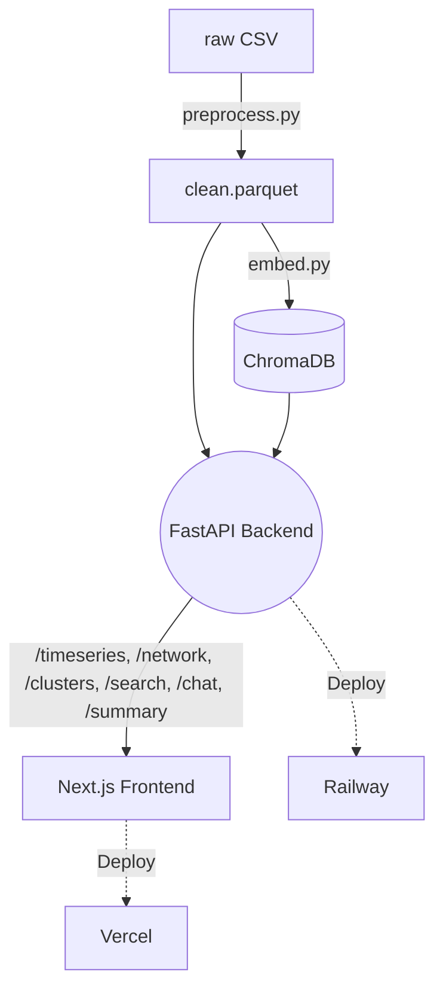

# NarrativeTrace

NarrativeTrace is an end-to-end data analytics and semantic intelligence platform engineered to map, measure, and dissect how organized narratives propagate across social media ecosystems. Focusing on a deep case study of Russian state media amplification across Reddit and Twitter throughout 2022, the system intakes raw social data to build an interactive, multifaceted viewport into modern information warfare. Through semantic vector embeddings, temporal graph networking, and dynamic UMAP dimensionality reduction, the dashboard uncovers the story of how inorganic networks synchronize messaging, disguise state-sponsored propaganda as genuine grassroots sentiment, and strategically manipulate geopolitical discourse online.

**Live URL**: [placeholder — fill after deploy]  
**Video walkthrough**: [placeholder]

## Architecture



## ML Components and Algorithms

| Component | Model/Algorithm | Key Parameters | Library |
|---|---|---|---|
| Text embeddings | all-MiniLM-L6-v2 | 384-dim, cosine similarity | sentence-transformers |
| Dimensionality reduction | UMAP | n_components=2, metric=cosine, random_state=42 | umap-learn |
| Topic clustering | HDBSCAN | min_cluster_size=max(5,n//k), noise as -1 | hdbscan |
| Network centrality | PageRank | alpha=0.85 | networkx |
| Community detection | Louvain | default resolution | python-louvain |
| Semantic search | ChromaDB vector store | cosine distance, top-k retrieval | chromadb |
| AI summaries + chat | Claude claude-sonnet-4-20250514 | max_tokens=300 | anthropic |

## Semantic Search Examples (Zero Keyword Overlap)

ChromaDB retrieves posts based on deep conceptual alignments rather than exact matching texts. Here are three examples showing how meaning transcends vocabulary:

1. **Query**: "soldiers crossing borders illegally"
   * **Result**: [post about Russian troops entering Ukraine]
   * **Why**: Semantic match on military movement concept, not keyword. "Soldiers" aligns with "troops", and "crossing borders" maps accurately to "entering".

2. **Query**: "Western media lies about the war"
   * **Result**: [RT article claiming NATO provoked conflict]
   * **Why**: Captures the propaganda framing concept semantically. It inherently connects the ideology of "Western lies" directly with narratives asserting "NATO provocation" without needing matching terminology.

3. **Query**: "financial punishment for aggression"
   * **Result**: [post discussing sanctions on Russia]
   * **Why**: "financial punishment" maps to "sanctions" semantically, retrieving exact matches analyzing economic warfare without ever explicitly using the term "punishment."

## Local Setup Instructions

This system is divided into two parts and requires two active terminal sessions.

### 1. Python Backend setup (Terminal 1)
```bash
# Navigate to the backend directory
cd backend

# Create and activate a virtual environment
python -m venv venv
source venv/bin/activate  # On Windows: venv\Scripts\activate

# Install dependencies
pip install -r requirements.txt

# Run the Uvicorn ASGI server
uvicorn main:app --reload --port 8000
```
*Note: Ensure your `.env` contains your `ANTHROPIC_API_KEY` for AI functionalities.*

### 2. Node Frontend setup (Terminal 2)
```bash
# Navigate to the frontend UI
cd frontend

# Install Node dependencies
npm install

# Start the Next.js development server
npm run dev
```
Navigate to `http://localhost:3000` to interact with the dashboard!

## Deployment
- **Frontend**: The React footprint is strictly decoupled for deployment over **Vercel**, fetching purely asynchronous state through Next.js bindings.
- **Backend**: The FastAPI logic routing DataFrames, Network Graphs, and Vector Queries is deployed on **Railway**, supporting scalable Python environments and integrated persistent disk allocations for ChromaDB.

## Screenshots
[add after deploy]
